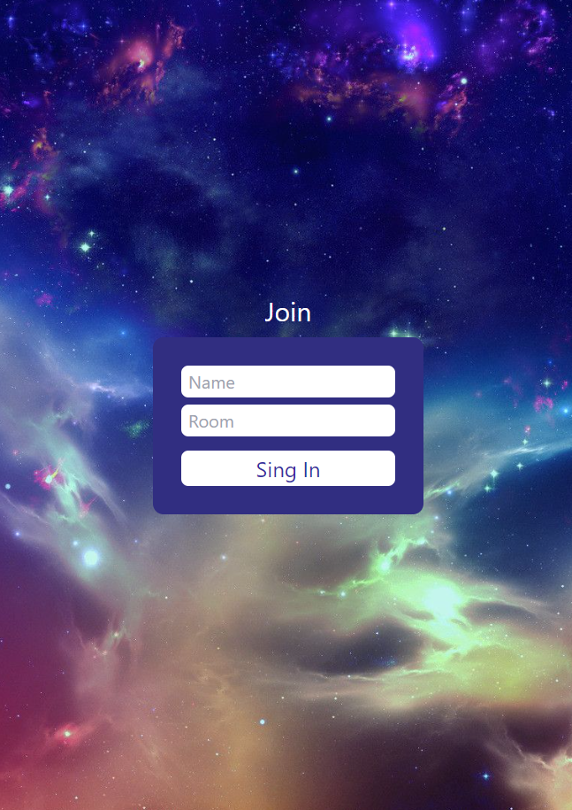
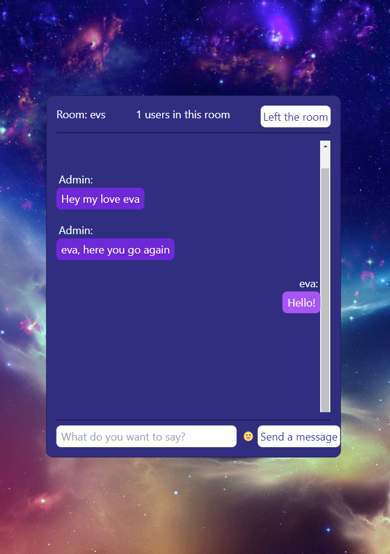

# Simple chat with private rooms.

To get started, just enter the nickname and the name of the room. If you want to
get into a specific room, then you need to enter its name.

At the moment, user information and dialogs are not saved, chat history is not
maintained.

## Server by link

- [GitHub](https://github.com/Evgenija-P/chat-server)
- [Render](https://chat-bn62.onrender.com)

Technology stack:

1. Server:

- Cosr;
- Express;
- Nodemon;
- Socket.IO;

2. Client:

- React;
- React Router DOM;
- Tailwind CSS;
- Socket.IO;
- Emoji Picker.

_Attention!!!!_ This is an educational project! The chat is not configured for
security and encryption! Do not send payment data and other confidential
information in messages!!

Screenshots:

- Login Page 
- Chat 
